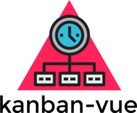

[ ](https://david-dm.org/michaeldegroot/kanban-vue 'david-dm')
[](https://coveralls.io/github/michaeldegroot/kanban-vue?branch=master)
[ ](https://travis-ci.org/michaeldegroot/kanban-vue 'travis-ci')


> A modern kanban created in Vue with RESTful api

# Build Setup
``` bash
# install dependencies
npm install

# serve with hot reload at localhost:8080
npm run dev

# build for production with minification
npm run build

# run unit tests
npm run unit

# run all tests
npm test
```

For detailed explanation on how things work, checkout the [guide](http://vuejs-templates.github.io/webpack/) and [docs for vue-loader](http://vuejs.github.io/vue-loader).

# Stack

### Main technologies
- [VueJS](https://vuejs.org/)
- [Socket.IO](http://socket.io/)

### Libraries
- [Bootstrap](http://getbootstrap.com/)

### Unit testing
- [Karma](http://karma-runner.github.io/1.0/index.html)
- [Mocha](https://mochajs.org/)
- [PhantomJS](http://phantomjs.org/)

### Bundlers
- [Webpack](https://webpack.github.io/)
- [Babel](https://babeljs.io/)

### Continuous integeration
- [Travis-CI](https://travis-ci.org/)
- [Coveralls](https://coveralls.io/)

# Contributing
[Check our CONTRIBUTING.MD](https://github.com/michaeldegroot/kanban-vue/blob/master/CONTRIBUTING.md)
